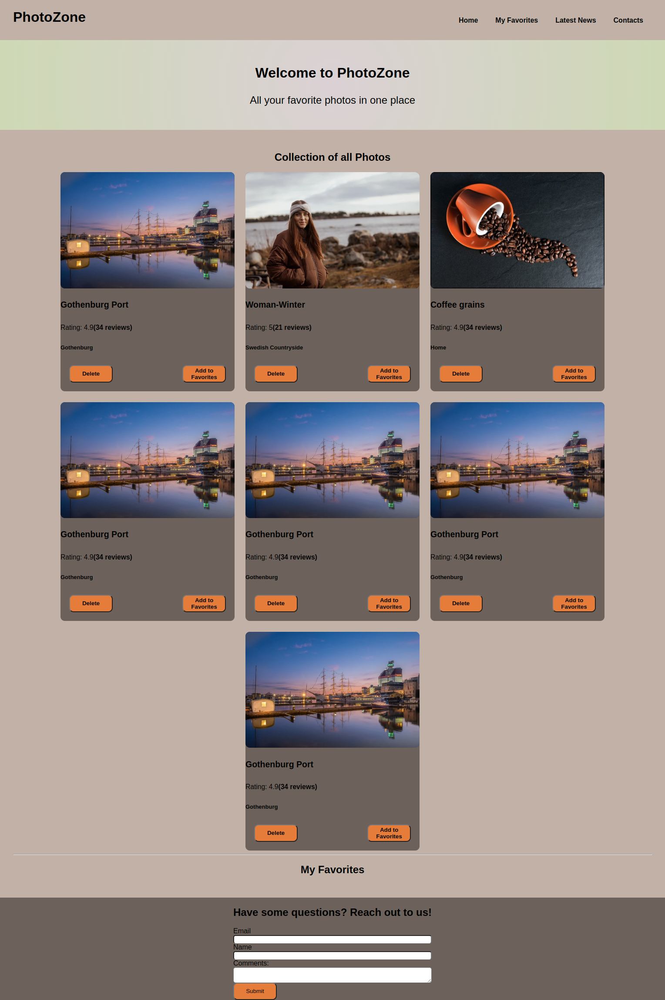

# Welcome to PhotoZone
This is a photo fetch-and-display website, 05/10/2022

By Kevin Kipkoech

## **Table of Contents**
[Description](#description)

[Installation Requirements](#installationrequirements)

[Installation Process](#installationprocess)

[Technology Used](#technologyused)

[References](#references)

[License](#license)

[Author Contact Info](#authorcontactinfo)
## **Description**
This website was developed using React.js. It fetches photos from a local API (adopted from the UnSplash API) and renders them in the DOM.Several click actions can be carried out on each photo element.  
## **Installation Requirements**
To install and run this project, you need:

-a laptop with a pre-installed operating system.

-Internet connection

-node installed on computer
## **Installation Process**
1. Clone the project onto your computer using the git clone command. Remember to use my repository address as the source. 
2. After ensuring you have all the files, open the directory in VSCode and run these commands:

    npm install

    npm start

3. The website may fail to display contents earlier on depending on internet space and ability to access online resources such as the font-awesome library and the API. If that happens, please give it a few minutes. 
## **Technology Used**
-HTML: Used to construct the page's structure and add content.

-CSS: Used to style the page and make it as appealing as possible. 

-JS: Used to make the website interactive and functional.

-React.js: Used to make the website modular and interactive. JS is incorporated into it. 

-Markdown: Used to write this readme file.

## **License**
MIT License Copyright (c) 2022 Kevin Kipkoech
## **Author Contact Info**
[Twitter](twitter.com/KevinKipkoechM1?s=09)

[Email](kevin.kipkoech@student.moringaschool.com)

[LinkedIn](https://www.linkedin.com/in/kevin-kipkoech-651a15108)

 ## **Page Screenshot**

 
